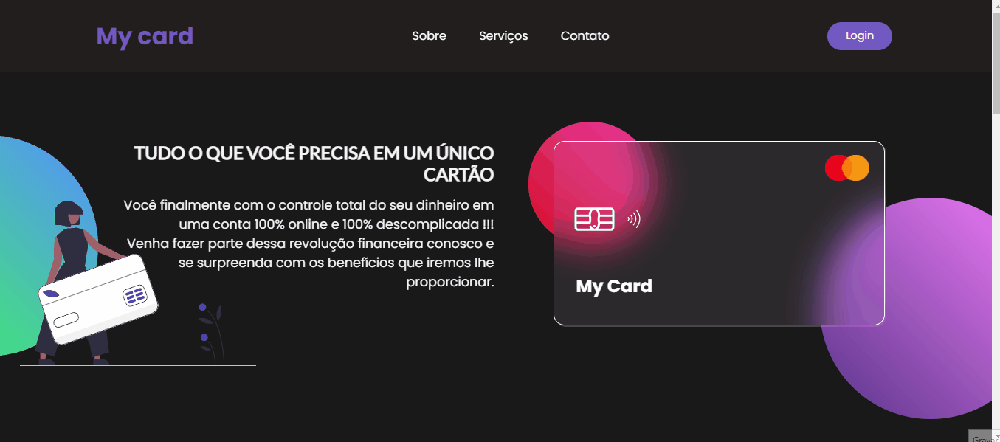
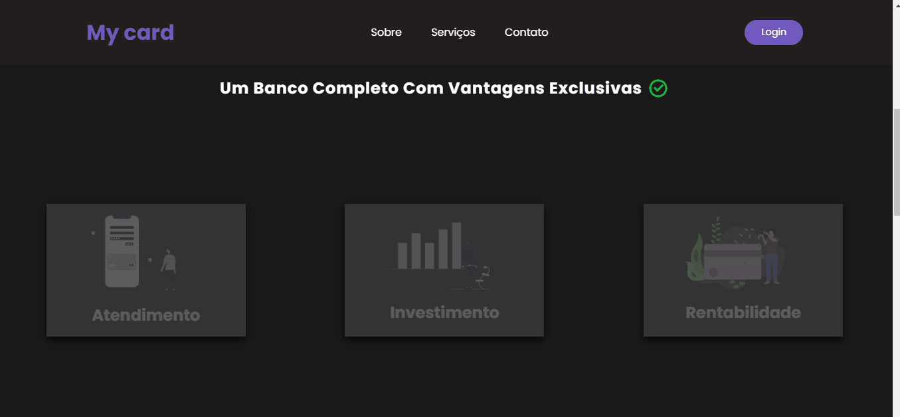
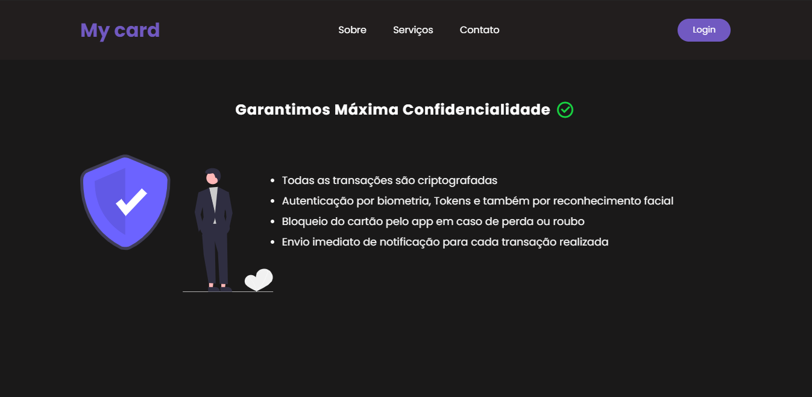
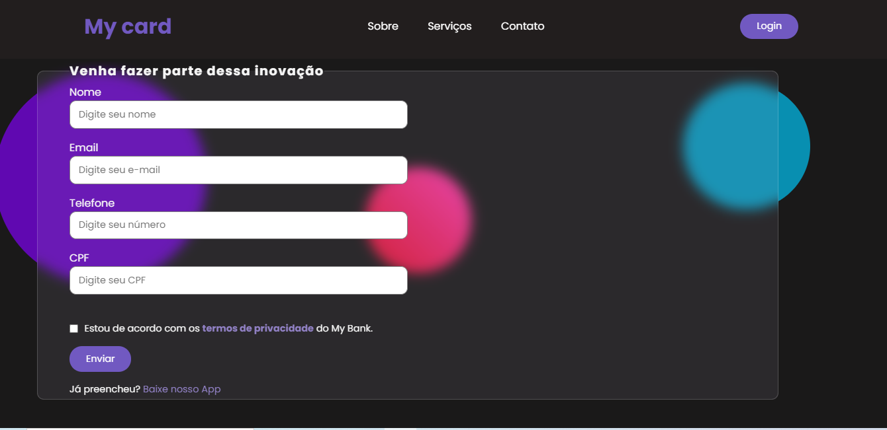

# Projeto My Card

 

## 🚀 Tecnologias

Esse projeto foi desenvolvido com as seguintes tecnologias:

- HTML
- CSS

 

## 💻 Projeto

O My Card é um ladding page de um banco digital fictício, com o objetivo de refinar minha pratica com HTML/CSS, como por exemplo o efeito de Glassmorphism e algumas animações simples.

 

## 🔖 Layout Responsivo

- [x] 🚧 Em construção.

 
 
Feito com 🖤 por Gabriel Cavalheiro.
